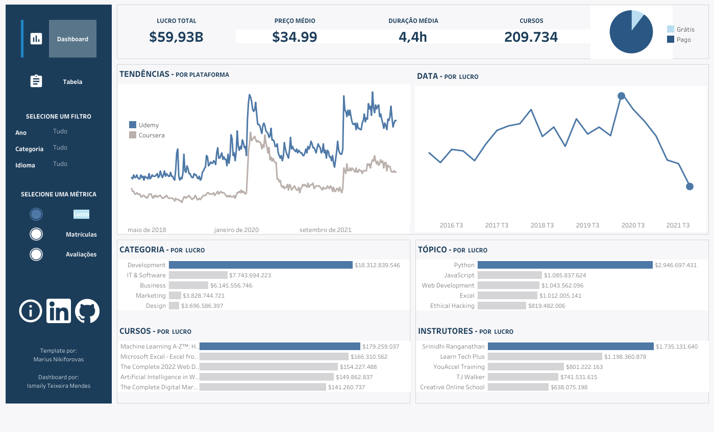
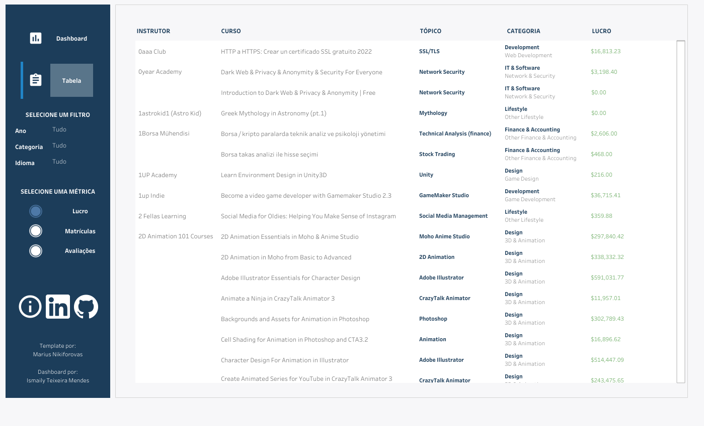

# mooc_udemy
       

# Análise da Plataforma de Ensino da Udemy

MOOC quer dizer Massive Open Online Courses, em português, Curso Online Aberto e Massivo. É um tipo de curso aberto oferecido por meio de ambientes virtuais de aprendizagem que visam oferecer para um grande número de alunos a oportunidade de ampliar seus conhecimentos.

A Udemy é uma plataforma MOOC de aprendizagem e ensino online mais popular do mercado, possuindo mais de 200 mil cursos abrangendo em torno de 75 idiomas. O objetivo deste projeto é analisar a plataforma como um todo, com ênfase em seus cursos para determinar quais são os mais vendidos, melhor avaliados, que possuem mais alunos e os mais vendidos.

## Tecnologias utilizadas:

* [Jupyter Notebook](https://jupyter.org/)
* [Python](https://www.python.org/)
* [Pandas](https://pandas.pydata.org/)
* [NumPy](https://numpy.org/)
* [Matplotlib](https://matplotlib.org/)
* [Searborn](https://seaborn.pydata.org)
* [Plotly Express](https://plotly.com/python/plotly-express/)
* [Tableau](https://pypi.org/project/gTTS/)

## Dashboard:
Para acessar o dashboard pelo Tableau Public [clique aqui.](https://public.tableau.com/views/NorthwindSalesDashboard_16788121336900/Dashboard?:language=pt-BR&:display_count=n&:origin=viz_share_link) ou [aqui](https://public.tableau.com/views/MOOCUdemyen/Dashboard?:language=en-US&:display_count=n&:origin=viz_share_link).

